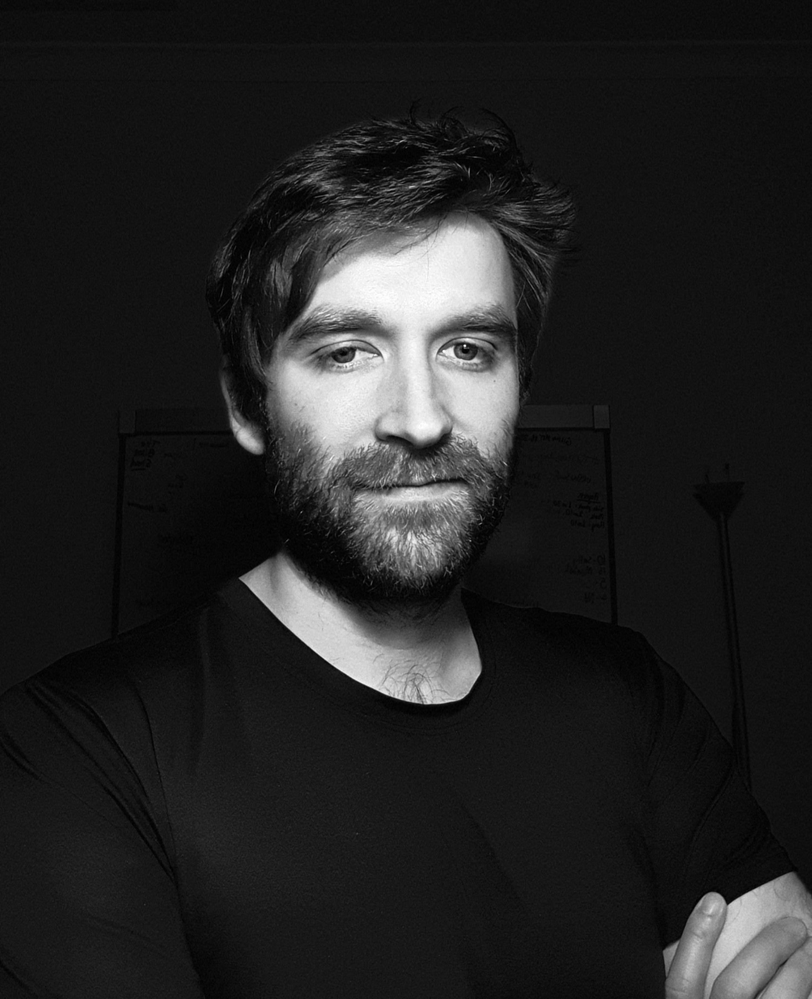

## Welcome!

Hey math boffins, welcome to the coding with R class! Let me introduce you to our team:

- Hi, I'm Emi! I'm a lecturer in statistics at Monash University.
- I teach statistics and also what people call "data-science". I also do research in areas like data visualisation, statistical modelling and designing experiments. 

- Hi, I'm Kevin! I'm a statistician at CSL Behring.
- I use statistics to control the quality of life-saving medicines and vaccines. 

- Hey! I'm Danny, a PhD student in statistics at The University of Queensland.
- I work to develop transparency, honesty, and clarity in scientific knowledge discovery, through research, teaching, and software.

- Hi, I'm Patrick! I'm a machine learning engineer at Nimble Australia.
- I use statistics and machine learning to work out how risky it is to lend money.

### Exercise 

*Introduce yourself to the other members of your team, and brainstorm a team name. You've got five minutes!* 

*Nominate a spokesperson to give a 1 minute intro for the team to us all.*