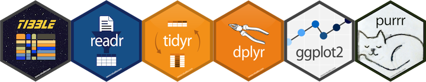

## Data frames, tibbles, matrices, vectors

```{r fig.align='center'}

```

The strength of R is the contribution from people globally, in the form of packages. One of the most used suite of packages is called the `tidyverse`. It has many really easy to use, and nicely contructed functions for reading data, organising data into a format that can be plotted, modelled and analysed. 

To use a package you load the library:

```
library(tidyverse)
```

If you get an error when you load a library, then your version of R on your computer doesn't yet have that package. So you would need to install it using `install.packages("tidyverse")`. You would install once, but load the library every time you start R when you want to use it. WE DON'T NEED TO INSTALL ANY PACKAGES TODAY, EVERYTHING HAS BEEN PRE-INSTALLED. 

Let's take a look at the `tidyverse` package. (It has these packages, `ggplot2`, `tibble`, `tidyr`, `readr`, `purrr`, `dplyr` that will be all loaded when `tidyverse` is loaded.) Load the `tidyverse` library:

```{r echo=TRUE, warning=FALSE}
library(tidyverse)
data(diamonds)
diamonds
```

The diamonds data is one of the data sets provided with the tidyverse to help you learn R. It contains measurements on 50000 diamonds, from a large database of sales. There are 10 variables. Look at the top of overview of the data provided, and you will see the variable labels, and a short-hand description of the type of variable is in the column: `dbl` means numeric, high precision; `ord` is an ordered categorical variable; `int` is a numeric that takes only integer values. Other possible types include `chr` is a text or categorical variable, `fctr` a special type of categorical variable with levels, `date` contains a date, and `lgl` means logical (`TRUE` or `FALSE`). 
