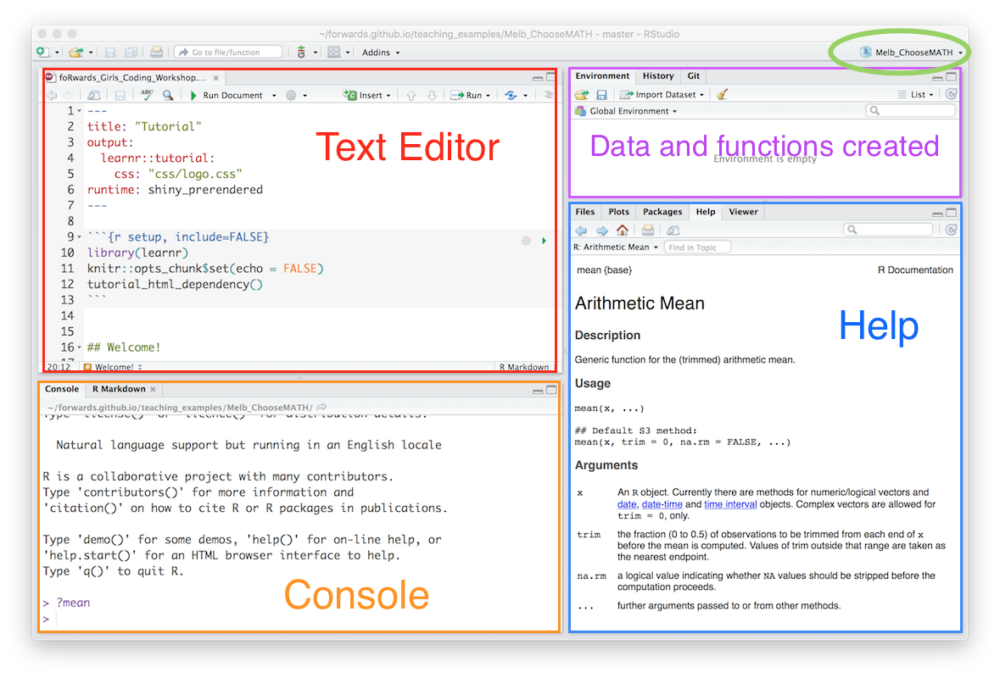
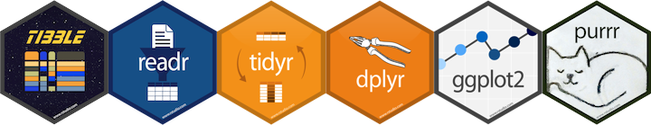

```{r setup, include=FALSE}
library(learnr)
knitr::opts_chunk$set(echo = FALSE,
                      comment="")
tutorial_html_dependency()
```


## Welcome!

Hey math boffins, welcome to the coding with R class! Let me introduce you to our team:


- Hi, I'm Emi! I'm a lecturer in statistics at Monash University.
- (WHAT DO YOU DO EMI?)


- Hi, I'm Kevin! I'm a statistician at CSL Behring.
- I use statistics to control the quality of life-saving medicines and vaccines. 


### Exercise 

*Introduce yourself to the other members of your team, and brainstorm a team name. You've got five minutes!* 

*Nominate a spokesperson to give a 1 minute intro for the team to us all.*


## Let's get started learning R! 

- *Login to your computer.* 
- *Open RStudio, using `Start -> All Programs`*
- *Create a project for your work. On the very right side of the window is a small blue R, and a drop-down menu. Select `New project`, then `New directory`, navigate to the desktop, and name the project `ChooseMATH`. This will create a folder with this name on the desktop. This will be our workspace for the day.*

```{r fig.height = 6, fig.width = 8, fig.align='center'}

```

## What is R!

The R project is a huge open source software collaboration. There is a foundation team of 36 people, and contributions from thousands of people globally. You can learn more about the project by visiting this web site [https://www.r-project.org](https://www.r-project.org).

R is the language of data analysis! It is the top program used for data science today, one of the most powerful tools available, and completely free for anyone to use. 

RStudio is commercial product, but it is free to most of us, and it provides an interface to help us use the R language. 

*If R is the airplane, RStudio is the airport terminal that provides the support.*

## Start coding!

The RStudio window has mutiple panes.

- *Console*: you can type R commands and see output
- *Help*: find out information about functions and packages. This same panel will have tabs for *showing plots* that you make, *view apps* and documents, show *files* in the folder, and *packages* used. 
- *Environment*: lists the objects that you create, such as data sets.
- *Editor*: for creating scripts to run in pieces or as a whole (like this document!)

R is a scripting language, which means that it is just like writing an essay, or a math proof. We write a script to do specific tasks, that we can run again and again, or give to someone else to run. 

*Write the R code required to add two plus two (yes, it is as simple as typing `2+2` below:*

```{r two-plus-two, exercise=TRUE}

```

*R is like a big calculator! Try doing other math operations, like subtraction, multiplication, division, or square root and power operations.*

## Quiz

```{r operators}
quiz(
  question("Which symbol/operator is used to indicate raising a number to a power?",
    answer("`+`"),
    answer("`/`"),
    answer("`^`", correct = TRUE),
    answer("`%`")
  ),
  question("If you want to find the remainder of 5 divided by 2, which operator is used?",
    answer("`%%`", correct = TRUE),
    answer("`%/%`"),
    answer("`|`"),
    answer("`*`")
    )
)
```


## Functions

In math, we use functions all the time. Functions have inputs and outputs, e.g. $f(x) = 3x^2+x+1$

R can be considered to be a functional language. These are functions that we have just used, `rnorm(), mean(), sd()`. 

What does a function in R look like? The polynomial function above would look like this in R:

```
mypolyfn <- function(x) {
  f <- 3*x^2 + x + 1
  return(f)
}
```

It takes `x` as the input, and returns `f` as output. The benefit of functions is that it makes your work more efficient - anything that you need to do again and again, or on different sets of data, should be programmed into a function.

*Try it!* Write the function below, so that it is defined. And then test it out by inputting different values of `x`, e.g. `mypolyfn(2)`, or `mypolyfn(-1)`, or even entering a vector of `x`'s, `mypolyfn(seq(-5, 5, 1))`

```{r functions, exercise=TRUE}

```

What can go wrong?

This function is expecting `x` to be a number. If the user inputs something other that a number, what happens? 

*Try it!* Try running your function with a text string of your team name instead of a number, e.g. `mypolyfn("numbat")`.

You get an error. Well-written functions check for silly user errors. A better version of the function would be:

```
mypolyfn <- function(x) {
  stopifnot(is.numeric(x))
  f <- 3*x^2 + x + 1
  return(f)
}
```

## YOUR TURN

With your team, experiment with writing functions, in your RStudio Window. Try to write a function that simulates a sample of size $n$ from a normal model, allowing the user to input the population mean and standard deviation. The retun values form the function should be the mean and standard deviation of the sample.

## Data frames, tibbles, matrices, vectors

```{r fig.align='center'}

```

The strength of R is the contribution from people globally, in the form of packages. One of the most used suite of packages is called the `tidyverse`. It has many really easy to use, and nicely contructed functions for reading data, organising data into a format that can be plotted, modelled and analysed. 

To use a package you load the library:

```
library(tidyverse)
```

If you get an error when you load a library, then your version of R on your computer doesn't yet have that package. So you would need to install it using `install.packages("tidyverse")`. You would install once, but load the library every time you start R when you want to use it. WE DON'T NEED TO INSTALL ANY PACKAGES TODAY, EVERYTHING HAS BEEN PRE-INSTALLED. 

Let's take a look at the `tidyverse` package. (It has these packages, `ggplot2`, `tibble`, `tidyr`, `readr`, `purrr`, `dplyr` that will be all loaded when `tidyverse` is loaded.) Load the `tidyverse` library:

```{r echo=TRUE, warning=FALSE}
library(tidyverse)
data(diamonds)
diamonds
```

The diamonds data is one of the data sets provided with the tidyverse to help you learn R. It contains measurements on 50000 diamonds, from a large database of sales. There are 10 variables. Look at the top of overview of the data provided, and you will see the variable labels, and a short-hand description of the type of variable is in the column: `dbl` means numeric, high precision; `ord` is an ordered categorical variable; `int` is a numeric that takes only integer values. Other possible types include `chr` is a text or categorical variable, `fctr` a special type of categorical variable with levels, `date` contains a date, and `lgl` means logical (`TRUE` or `FALSE`). 

## Quiz

Look at the data summary and answer these questions:

```{r datatypes}
quiz(
  question("What type of variable is carat?",
    answer("dbl", correct = TRUE),
    answer("int"),
    answer("ord"),
    answer("chr")
  ),
  question("What type of variable is cut?",
    answer("dbl"),
    answer("int"),
    answer("ord", correct = TRUE),
    answer("chr")
    ),
  question("What type of variable is price?",
    answer("dbl"),
    answer("int", correct = TRUE),
    answer("ord"),
    answer("chr")
    )
)
```

## Back to tibbles and matrices

The whole data set, diamonds is what the tidyverse calls a `tibble`. Tibble is a play on the word table! But it means data in a rectangular format, where there may be different types of variables (numeric, categorical, dates, ...) in different columns. A tibble is a special case of a `data.frame`. You can check the type of data object with a query:

```{r echo=TRUE}
is_tibble(diamonds)
is.data.frame(diamonds)
is.matrix(diamonds)
```

*Aside: The tidyverse tends to use `_` in its function names. Older parts of R tend to use `.` to separate words in function names.*

So diamonds is a tibble and a data.frame, but it is not a matrix. 

When you simulated the sample from a normal model, 

```{r echo=TRUE}
x <- rnorm(100)
is_tibble(x)
is.data.frame(x)
is.matrix(x)
is.vector(x)
```

you created a `vector`. A vector is a column of numbers, and a `matrix` is a rectangular format of data, like a tibble, it has variables in columns, but it can only contain numeric values. 

Knowing the data type, is important because some functions expect one sort of data and can throw an error if it gets something different. You can convert data objects between types. 

A good resource on learning more about the `tidyverse` is the book "R for Data Science" by Garret Grolemund and Hadley Wickham. [You can read it free online.](http://r4ds.had.co.nz/)

## YOUR TURN: Tidy data verbs

With your group read sections 12.1-12.3 of [R for Data Science](http://r4ds.had.co.nz/tidy-data.html). Then answer these questions:

```{r tidydata}
quiz(
  question("What the three interrelated rules which make a dataset tidy?",
    answer("Each variable must have its own column.", correct = TRUE),
    answer("Each observation must have its own row.", correct = TRUE),
    answer("Each value must have its own cell.", correct = TRUE),
    answer("None of these")
  ),
  question("A common problem is a dataset where some of the column names are not names of variables, but values of a variable. What verb does an action which organises those columns into a new pair of variables?",
    answer("gather", correct = TRUE),
    answer("spread"),
    answer("mutate"),
    answer("select")
    ),
  question("What verb does the opposite to gather?",
    answer("gather"),
    answer("spread", correct = TRUE),
    answer("mutate"),
    answer("select")
    ) 
)
```

## Loading the `pokemon` data

Today, we will play with a Pokemon data. This data was originally sourced from [Kaggle](https://www.kaggle.com/rounakbanik/pokemon) and recorded important imformation about 801 Pokemons. 

For this tutorial, you will play with a subset of these data. And we have loaded the data for you here:

```{r, echo = TRUE}
pokemon = read_csv("data/pokemon_demo.csv")
```

If you want, you can play with the full data at the end of this tutorial by running the code: 

```{r, eval = FALSE, echo = TRUE}
pokemon = read_csv("data/pokemon_full.csv")
```


## Wrangling verbs

The vast majority of data cleaning tasks can be handled with five verbs:

- `filter()` Pick observations by their values.
- `arrange()` Reorder the rows.
- `select()` Pick variables by their names.
- `mutate()` Create new variables with functions of existing variables.
- `summarise()` Collapse many values down to a single summary.

Oh, and if you use the pipe, `%>%`, you can string several of these actions together to make a data pipeline.

You can find a data wrangling cheatsheet [here](https://github.com/rstudio/cheatsheets/raw/master/source/pdfs/data-transformation-cheatsheet.pdf).


### Filter

Filter is used to pick some cases or observations (rows) in the data. Here's an example for the `pokemon` data. We will choose just the Pokemons that are "grass" type (use the `type1` variable). 

```{r, eval = TRUE}
## remotes::install_github("schochastics/Rokemon")
library(Rokemon)

readr::write_csv(
  x = Rokemon::pokemon %>% 
    dplyr::select(pokedex_number, name, 
                  type1, type2, 
                  # generation, is_legendary,
                  height_m, weight_kg,
                  attack, defense
                  # hp, speed,
                  # sp_attack, sp_defense
                  ),
  file = "./data/pokemon_demo.csv")

readr::write_csv(
  x = Rokemon::pokemon %>% dplyr::select(-abilities),
  file = "./data/pokemon_full.csv")
```

```{r echo=TRUE}
pokemon %>% filter(type1 == "grass")
```

*Try it!* Do these exercises:

- Filter the `pokemon` data to pick only Pokemons that are "fire" type (use the `type2` variable)
- Filter the Pokemons that are more than 150 units in `attack` (HINT: you can use `>` or `<` if the variable is just made up of numbers)
- Filter the Pokemons that are either "fire" in `type1` **or** "water" in `type1` (HINT: You need to use the operator `%in%` like this `%in% c("fire","water"))`
- Filter the POkemons that are "fire" in `type1` **and** "water" in `type2` (HINT: You can add additional conditions in the `filter` function by adding an extra comma like `filter(type1 == "fire", ...)`)

```{r, eval = FALSE}
pokemon %>% filter(type2 == "fire")
pokemon %>% filter(attack > 150)
pokemon %>% filter(type1 %in% c("fire", "water"))
pokemon %>% filter(type1 == "fire", type2 == "water")
```

```{r filter, exercise=TRUE}

```

### Select

Select is used to pick some variables in the data. Here's an example for the `pokemon` data. We will select just the variables `name` and `attack`.

```{r echo=TRUE}
pokemon %>% select(name, attack) 
```

*Try it!* Select the variables `name`, `type1`, `attack` and `defense`.

```{r select, exercise=TRUE}

```

### Arrange

`arrange` sorts the data by values in one of the columns. Here's an example which also involves selecting a subset of variables.

```{r echo=TRUE}
pokemon %>% 
  select(name, attack) %>%
  arrange(desc(attack))
```

Note that `desc` arranges in descending order. 

*Try it!* Arrange Pokemons by `attack`, in increasing order.

```{r arrange, exercise=TRUE}

```

Arrange is mostly used to get quick views of the numbers.

### Mutate

I love the name mutate! It means to create new variables, or modify existing ones. For the `pokemon` dataset, we might be interested in examining the sum of both `attack` and `defense` as a simple way of summairsing a Pokemon's ability. Here's how we can create this variable:

```{r echo=TRUE}
pokemon %>% 
  mutate(total = attack + defense)
```

*Try it!* Compute a new variable called `bmi` (body mass index), which is computed as:

$$bmi = \frac{\text{weight}}{\text{height}^2}.$$

```{r mutate, exercise=TRUE}

```

### Summarise

Summarise is the workhorse function. It takes columns of the data, and reduces them to single numbers. It is most useful when we want to compute statistics for our. 

For the `pokemon` data, we might be interested in computing the mean, minimum and maximum of `attack` value of all Pokemons. 

```{r echo=TRUE}
pokemon %>% 
  summarise(
    min = min(attack),
    mean = mean(attack),
    max = max(attack)
  )
```
S
However, the `attack` value might be dependent on the type of the Pokemons, so we can compute this separately for each of the `type1` categories. Which type of Pokemon has the highest average `attack`?

```{r echo=TRUE}
pokemon %>% 
  group_by(type1) %>% 
  summarise(mean = mean(attack))
```

If it helps, we can use `arrange` to better help us to answer this question. 

```{r}
pokemon %>% 
  group_by(type1) %>% 
  summarise(mean = mean(attack)) %>% 
  arrange(desc(mean))
```

*Try it!* Compute the mean and standard deviation for (a) `attack`, (b) `defense`.

```{r summarise, exercise=TRUE}

```

## Grammar of graphics

Before we begin this section, I would like to invite you to take a look at two plots below and tell me what do you think the (only) difference is between the two plots?

```{r, echo = FALSE, fig.height=6, fig.width=6}
pokemon %>% 
  ggplot(aes(x = attack, 
             y = defense,
             colour = type1)) +
  geom_point()
```


```{r, echo = FALSE, fig.height=6, fig.width=6}
pokemon %>% 
  ggplot(aes(x = attack, 
             y = defense,
             colour = type1)) +
  geom_point() +
  facet_wrap(~type1)
```


In both plots, notice that:

+ x-axis is `attack`
+ y-axis is `defense`
+ Each observation (a Pokemon) is a simple point
+ colouring on the points is `type1`

From that perspective, both plots are presenting the same information to you! However, the second plot has one extra visual element, in that each type gets its own little plot, or "facet".

We are now ready to talk about the **grammar of graphics**. The grammar of graphics is a language that maps variables into graphical elements. If you take a look at how we have described the plots above, each graphical element (x-axis, y-axis, etc) correspond to one and only one variable (`attack`, `defense`, etc). Thus, instead of uniquely naming specialist plots, like barchart, pie chart, histogram... grammar of graphics provides a consistent way to describe a plot. If the two plots are communicating the same information except the "facet" component, then it makes sense that the codes that generated the two plots should be identical except that "facet" part (we will see soon how these are generated soon). It enables us to consistently compare how plots are similar and different. It gives us a more formal, and yes, mathematical way to make data plots. 


Grammar of graphics is implemented as a part of the `ggplot2` package which is a part of the `tidyverse`. A ggplot has these major elements:

```
ggplot(data = <DATA>) + 
  <GEOM_FUNCTION>(
     mapping = aes(<MAPPINGS>),
     stat = <STAT>, 
     position = <POSITION>
  ) +
  <COORDINATE_FUNCTION> +
  <FACET_FUNCTION>
```
  
- **DATA**: This is the `data.frame` or `tibble` that you are starting from
- **MAPPINGS**: Specific details of how a variable is mapped into the plot
- **GEOM**: The graphical element to use, e.g. point, line, rectangle, density, boxplot, ...
- **STAT**: A statistical calculation, if necessary, e.g. bin to make a histogram or barchart.
- **POSITION**: Some types of plots, like barcharts conventionally have small deviations in design, like stacked, side-by-side, 100%. Position enables this type of shift.
- **COORDINATE**: Most commonly we are using cartesian coordinates, but some plots benefit by putting them in polar coordinates, or even in a special map ratio, or some variables shown on a log scale.
- **FACET**: Split the data into subsets and plot separately. Good for making comparisons across groups. 

The `+` operation behaves exactly like you expect: it "adds" additional graphical elements or manipulations on the plot. This is similar to how you would draw a picture in real life first by finding some contents (in our case, the data) to draw on, then deciding what should be in the picture (the geom) and finally adding on other elements (the mappings, e.g. colours).


### Making scatter plot

We will now try to construct the scatter plots above. Notice how we have described the mapping between the variables, this is exactly how we will construct the plot!

```{r, echo = FALSE, fig.height=6, fig.width=6}
ggplot(pokemon) +
  geom_point(aes(x = attack, 
                 y = defense,
                 colour = type1))
```

This plot doesn't look too bad, however, one thing that we noticed was that there are lots of types and they are overlaying on top of each other on the same plot. How would we improve over this? This is exactly why we use facets in the first example to separate out the points by types. Facetting is very easy in ggplot, it simply needs an extra line and a specification of which variable should be used as the facets.

```{r, fig.height=6, fig.width=6}
ggplot(pokemon) +
  geom_point(aes(x = attack, 
                 y = defense,
                 colour = type1)) +
  facet_wrap(~type1)
```

This plot is better in that we can compare the scattering of points across different types of Pokemons now whereas before, our eyes are too busy trying to identify the colours. In fact, you will notice that we used the `type1` variable twice, which means that this variable appeared twice as two different visual elements - once as colour and once as facets. This is ok, but it can be redundant. Having a consistent way of describing plots allows us to notice such things and we may even decide removing `type1` as a colour variable. 

**Try it:** remove the `type1` as the colouring variable in the plot above. What is the default colour of `geom_point`?

```{r ggplot-point, exercise = TRUE}

```

<!-- Here are some examples. We will use with a smaller subset of the diamonds for efficiency. -->

<!-- ```{r echo=TRUE} -->
<!-- diamonds_small <- diamonds %>% sample_n(1000) -->
<!-- ggplot(diamonds_small) + -->
<!--   geom_point(aes(x=carat, y=price)) -->
<!-- ``` -->

<!-- This is a scatterplot of price by carat. There is a hint in the plot that carat tends to fall along some standard values, e.g. 1, 1.5, ... There are more small diamonds than larger ones - we would describe carat as right-skewed. Price is also right-skewed, as there are many more low prices diamonds than expensive ones.  -->

<!-- ```{r echo=TRUE} -->
<!-- ggplot(diamonds_small) + -->
<!--   geom_bar(aes(x=cut)) -->
<!-- ``` -->

<!-- This is a barchart of cut of the diamond. We can see that most diamonds have an "Ideal" cut, and there are very few "Fair" cut diamonds. -->

<!-- ```{r echo=TRUE} -->
<!-- ggplot(diamonds_small) + -->
<!--   geom_point(aes(x=carat, y=price, colour=cut)) -->
<!-- ``` -->

<!-- This is a scatterplot of price by carat, where points are coloured by the cut of the diamond. It is hard to see much difference in price between the cuts, there's a lot of overlap. It can be helpful to focus the view to display a model fit, instead of (or with) the points.  -->

<!-- ```{r echo=TRUE} -->
<!-- ggplot(diamonds_small) + -->
<!--   geom_smooth(aes(x=carat, y=price, colour=cut), se=FALSE) -->
<!-- ``` -->

<!-- There's really not much difference, at least for this subset. Maybe the Ideal cut has very slightly higher relative price. -->

<!-- Let's now look at two categorical variables. We examine cut and clarity. (Note that with a barchart, we need to use `fill` rather than `colour` to paint in the bars.) -->

<!-- ```{r echo=TRUE} -->
<!-- ggplot(diamonds_small) + -->
<!--   geom_bar(aes(x=cut, fill=clarity)) -->
<!-- ``` -->

<!-- To examine the association between two categorical variables, it can be better to focus on proportions, rather than counts. The counts in the different cut categories are very different, and its hard to be able to say that the proportion of the clarity categories are the same or different in each bar. Here's where position helps: -->

<!-- ```{r echo=TRUE} -->
<!-- ggplot(diamonds_small) + -->
<!--   geom_bar(aes(x=cut, fill=clarity), position="fill") -->
<!-- ``` -->

<!-- Now we can see that there are differences in the clarity for different cuts. The Ideal cut tends not to have I1 clarity diamonds, and the Fair cut diamonds tend not to have any IF clarity diamonds.  -->

<!-- *Try it!* Change the position to be `dodge`, and see what type of plot is created. -->

<!-- ```{r dodge, exercise=TRUE} -->

<!-- ``` -->

<!-- Its also possible to make separate plots for each of the clarity categories, using facet: -->

<!-- ```{r echo=TRUE} -->
<!-- ggplot(diamonds_small) + -->
<!--   geom_bar(aes(x=cut, fill=clarity)) + -->
<!--   facet_wrap(~clarity, ncol=4, scales="free_x") + -->
<!--   coord_flip() + theme(legend.position="bottom") -->
<!-- ``` -->

<!-- Now we can see the the distribution of cuts is different in the l1 and SI2 clarity categories, but fairly similar in the others. The IF clarity group is almost exclusively Ideal cut.  -->

<!-- When you have a categorical variable, and a quantitative variable, a good type of display is the side-by-side boxplot. Let's look at price by cut. -->

<!-- ```{r echo=TRUE} -->
<!-- ggplot(diamonds_small) + -->
<!--   geom_boxplot(aes(x=cut, y=price, fill=cut)) -->
<!-- ``` -->

<!-- We can see that the Fair cut diamonds tend to be slightly more expensive.  -->

<!-- ```{r boxplot} -->
<!-- quiz( -->
<!--   question("In a boxplot what does the line in the middle of the box represent?", -->
<!--     answer("median", correct = TRUE), -->
<!--     answer("mean"), -->
<!--     answer("standard deviation"), -->
<!--     answer("Interquartile range") -->
<!--   ), -->
<!--   question("In a boxplot what does the box represent?", -->
<!--     answer("median"), -->
<!--     answer("mean"), -->
<!--     answer("standard deviation"), -->
<!--     answer("interquartile range", correct = TRUE) -->
<!--   ) -->
<!-- ) -->
<!-- ``` -->

<!-- *Try it!* Examine the side-by-side boxplot of price by clarity. Is there a difference in price across the different clarity groups? Also try out `geom_violin` instead of `geom_boxplot`. What does this do?  -->

<!-- ```{r violin, exercise=TRUE} -->

<!-- ``` -->

There is a chapter on visualisation in [R for Data Science](http://r4ds.had.co.nz/data-visualisation.html) with lots of examples. If you have time, take a skim through this and try out some of the ideas. There is also a [graphics cheatsheet](https://www.rstudio.com/wp-content/uploads/2016/11/ggplot2-cheatsheet-2.1.pdf) that can be useful to learn about all sorts of geoms, options, transformations, themes, ...

### (Advanced) making a heatmap

Have you ever thought about why would anyone use any plots? If our data is the original complete information, then why don't we just interpret that information directly? Afterall, any plot that we make can only represent the data in limit ways because there are only limited number of visual elements we can throw onto a plot.

The key to answer this question is that, a plot should be a tool of communication of key information. Yes, a data may contain lots of information, but without summarising the data in clever ways, nothing can be interpreted because data are often huge. 

Let's see an example of this. In the `pokemon` data, there are `type1` and `type2` variables. These variables indicate the type of a certain Pokemon with some Pokemons having only `type1` but many Pokemons has both. So what can we do to understand the total number of Pokemons in each categories of `type1` and `type2`? 

We could certainly tabulate these counts. But we would end up with 166 categories, which is still too much for us to understand. We can see the average or maximum of these counts, but this can be very limiting. This is where data visualisation can help us to see important patterns.

```{r, echo = TRUE}
poke_counts = pokemon %>% 
  group_by(type1, type2) %>% 
  tally()

poke_counts
```

In the plot below, we see that each number is represented as a "tile", and the "fill" colour of the tile is represented by the number of pokemons in those combined categories of `type1` and `type2`.

```{r, echo = TRUE}
poke_counts %>% 
  ggplot() +
  geom_tile(aes(x = type1, y = type2,
             fill = n))
```

We can further make adjustments on the plot to make it prettier. It is not necessary to understand the code below, but you should feel free to play with the different options and layers of the ggplot to see what each element is doing. 

```{r, echo = TRUE}
poke_counts %>% 
  ggplot(aes(x = fct_reorder(type1, n, .fun = max), 
             y = fct_reorder(type2, n, .fun = max))) +
  geom_tile(aes(fill = n)) +
  geom_text(aes(label = n)) +
  scale_fill_distiller(palette = "Spectral", 
                       breaks = c(0, 10, 20, 30, 40, 50, 60)) +
  theme(axis.text.x = element_text(angle = 90, vjust = 0.2)) +
  labs(x = "Type 1", 
       y = "Type 2",
       fill = "Num. Pokemons")
```

**Try it**: 

+ What does `scale_fill_distiller` do? (HINT: comment this line out by adding a `#` in front of the line of code and run again)
+ What does `theme(axis.text.x = ...)` do? What if you change the `angle` to 45?
+ What does `labs(...)` do? 
+ Replace `x = fct_reorder(type1, n, .fun = max)` in the second line with just `x = type1` as we had before. What happened to the plot? Can you guess what `fct_reorder` do?

## Linear model

You might have hear of linear model before: it is a commonly used statistical model for numeric data. The application of a linear model is a whole subject in itself, but it has intuitive outputs and interpretations.

Let's try and make a scatter plot between the weight of the Pokemons against the defense. It is probably useful to know that you can save the plot too. (We will put the `mapping` inside the `ggplot()` function for reasons that will become obvious soon.)

```{r, echo=TRUE, warning = FALSE}
plot1 = ggplot(
  data = pokemon,
  mapping = aes(x = defense, 
                y = weight_kg)) +
  geom_point()

print(plot1)
```

The `lm` function (stand for "linear model") is the main function you would use to fit a linear model in `R`. It has a simple syntax: 

```
lm(response ~ predictor, data = data)
```

where: 

+ `response` is the dependent variable. It is often the variable you want to understand the most.
+ `predictor` is the independent variable. It is often the variable you want to relate to the response variable. 
+ `data` is a `data.frame` or a `tibble`.
+ `~` is a special symbol. I usually like to read it as "explained by". This fits in with the idea that the `response` variable is often a more complex measurement that you want to explain by some simpler measured `predictor` variable.

In our plot above, we might suspect that a Pokemon's weight (y-axis) is increasing with the defense statistic (x-axis). So we would regard the weight as the response variable and the defense as the predictor variable. We can make a model and summarise the model using the `summary()` function:

```{r, echo=TRUE}
model = lm(weight_kg ~ defense, data = pokemon)

summary(model)
```

Interpreting all the outputs of the summary will require years of training in statistics. However, two things that you can interpret straight the way are: 

1. The "intercept" term: which is estimated as `r round(coef(model)[1], 4)`. This is the estimated weight of a Pokemon when its defense value is exactly zero. 
2. The "slope" term: which is estimated as `r round(coef(model)[2], 4)`. This is the estimated increase in weight of a Pokemon when its defense value is increased by one unit. 

Together, our linear model tells us, that even though this data has lots of points, but **on average**, a Pokemon will have `r round(coef(model)[2], 4)` increase in weight, when its defense value is increased by one units. Thus confirming a positive relationship between the two variables. 

There is a good reason why we used these terms "intercept" and "slope": because the linear model is actually just a straight line that you already learnt about in high school! We can plot it on the data using ggplot! 

```{r, echo=TRUE, warning = FALSE}
plot1 + 
  geom_smooth(method = "lm")
```

The `geom_smooth` function will want to add extra graphical elements that display relationships between variables in the data (in statistics, this is referred to as "smoothing", hence the name). `method = "lm"` indicates the method that we want to use is linear model. 

You might say, hold on! We didn't tell `R` what are the response variable and the predictor variable! But you kind of already did back when you created `plot1` inside the `ggplot(aes(...))` functions, which specified `y = weight_kg` and `x = defense`. This is why these two mappings can be shared and the linear model on the plot always treats the `y` variable as the response variable and the `x` variable as the predictor variable.

Fitting a linear model is often an art that requires lots of thinking and understanding of the data. For example, the linear model that we have fitted could be more suitable if we use the logarithm of the weight as the response variable (below). However, you have already learnt a lot and you should have a play on the full Pokemon data!

```{r, echo=TRUE, warning = FALSE}
plot1 + 
  scale_y_log10(label = scales::comma_format(accuracy = 1)) +
  geom_smooth(method = "lm")
```

## Goal for the day

*The task for the rest of the day is to enhance the app that we have started. Add more features, change the plots, add more data, ... the choice is up to you. Come up with something that you think your friends, teachers or parents might like to explore about the PISA data.*

At the end of the day, we will have presentations from each group about your app. 

<a rel="license" href="http://creativecommons.org/licenses/by-sa/4.0/"></a><br />This work is licensed under a <a rel="license" href="http://creativecommons.org/licenses/by-sa/4.0/">Creative Commons Attribution-ShareAlike 4.0 International License</a>.
